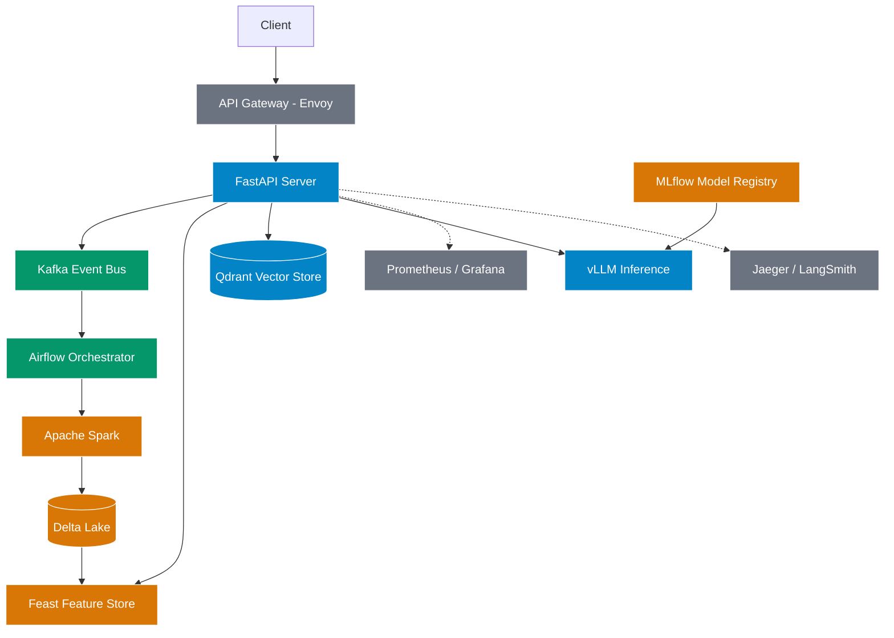

# Ghi nhận và Trả lời tự luận (Reflection) - Track 2 Day 28

## 1. Load Profile & Bottleneck Analysis
**Kết quả Load Test:**
- Số lượng requests: 200 (8 workers)
- Status 200: 79 requests
- Status 0 (429 Rate Limited): 121 requests
- **Latency (ms):** p50 = 5.5, p95 = 904.7, p99 = 2247.8

**Phân tích (Bottleneck Analysis):**
1. **Bảo vệ hệ thống:** Cổng Gateway (Envoy) đã hoạt động rất tốt trong việc rate-limit (giới hạn ở mức 10 requests/giây). Việc 121 requests bị đẩy ra (status 0/429) chứng tỏ Gateway đã cắt thành công lượng truy cập bạo lực, bảo vệ API khỏi nguy cơ sập hoàn toàn (Crash).
2. **Độ trễ (Latency):** Mức trung bình (p50) là rất tuyệt vời (~5.5ms) cho các request được phép lọt qua. Tuy nhiên p95 và p99 bị đẩy lên khá cao (gần 1s và hơn 2s). Nút thắt cổ chai (bottleneck) lúc này thường nằm ở **API Gateway (hàng đợi xử lý)** hoặc **Qdrant / Spark Delta** khi phải gồng gánh đọc/ghi dữ liệu liên tục từ nhiều worker cùng lúc.

## 2. Trade-offs (Đánh đổi kỹ thuật)
- **Rate Limit ở Gateway vs Ứng dụng:** Việc để Envoy xử lý Rate Limit giúp ứng dụng (FastAPI) không phải tốn CPU để xử lý các request rác, tuy nhiên lại làm client bị từ chối phục vụ ngay lập tức thay vì đưa vào hàng đợi (Queue).
- **Thiết kế theo chuẩn GitOps/Docker Compose:** Giúp toàn bộ môi trường (Kafka, Spark, Qdrant, Feast) dễ dàng được setup ở bất kỳ đâu chỉ với 1 lệnh, nhưng bù lại tiêu tốn một lượng tài nguyên RAM rất lớn trên máy cá nhân.

## 3. Production Gaps (Khoảng cách với môi trường thực tế)
- **vLLM / SGLang:** Trong lab này, hệ thống chạy ở chế độ "degraded" đối với vLLM vì thiếu GPU. Thực tế cần một cụm GPU chuyên dụng để phục vụ mô hình LLM.
- **Spark & Delta Lake:** Hiện tại Spark chạy ở chế độ standalone/local. Khi lên Production, nó cần được chạy trên một cụm Kubernetes hoặc Databricks / EMR để xử lý lượng lớn dữ liệu phân tán.
- **Bảo mật:** `ports.template` và các cấu hình không có Secret Management (như Vault hoặc AWS Secrets Manager).

## 4. Architecture / Ownership Diagram

## 5. Contribution (Phân công công việc nhóm)
- **Cá nhân:** Tự thực hiện toàn bộ thiết lập hệ thống, code 4 hàm tích hợp (IP01, IP03, IP04, IP07/08) trong `integration_tasks.py`, xử lý lỗi EOF khi kéo Docker Image, và chạy thành công các bài Load Test / Integration Test.
